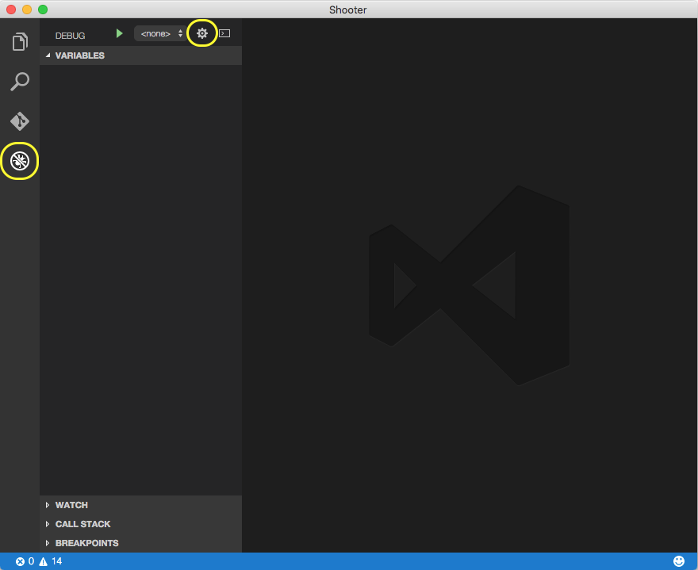
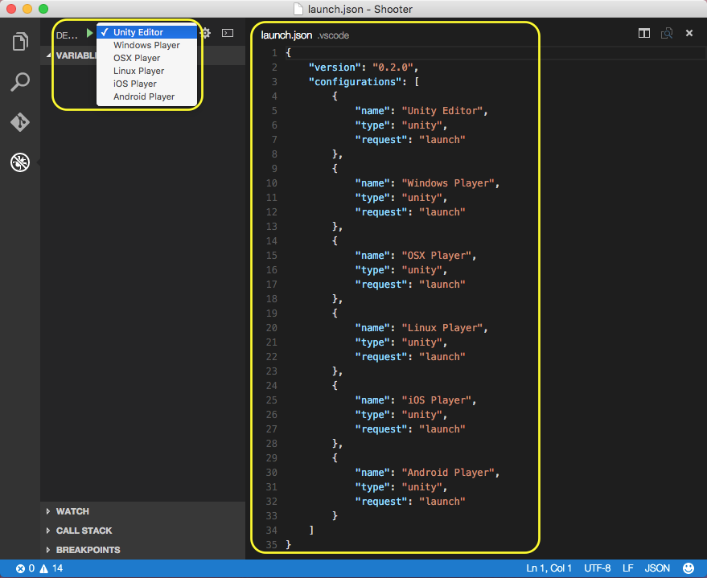

## Unity Debugger Extension for Visual Studio Code

This extension is not officially supported by Unity Technologies.

Use Visual Studio Code to debug your Unity C# projects.

## Setup

- Open your Unity project folder in the Visual Studio Code.

- Select the debug view on the left and click the cogwheel.



- In the drop down list select “Unity Debugger”. If you do not have Unity Debugger in the list, then you already have a .vscode/Launch.json file in your project that you must delete first.


- You will now have a .vscode/Launch.json file in your Unity project folder and can select which Unity target you wish to debug.



- All done. You can now debug your C# scripts in VS Code by setting a breakpoint in a C# script from your project, switching to the debug view and clicking the green triangle button to attach to Unity. Enter play mode in Unity and the breakpoint should hit in VS code.

## Attach to Process Picker

New in version 1.1.0 it is now possible to select which Unity process you want to attach to from a quick pick menu.

- In the command palette type "Unity Attach Debugger"

- Wait a bit for the Unity processes list to appear at the top of the VS Code window.

- Select the Unity process you wish to attach the debugger to.

## Usage

Strings in the variable view is truncated to 100 characters, with appended ellipsis. "Example wor...". To view the entire value of this string add it to the watch fields. In addition, evaluating the variable using the debugger console will reveal the same result.

## Building

To build this repository, clone it then get all submodules:

```bash
git clone https://github.com/Unity-Technologies/vscode-unity-debug
cd vscode-unity-debug
git submodule update --init --recursive
```
Then open `VSCode-UnityDebug.sln` in Visual Studio.
